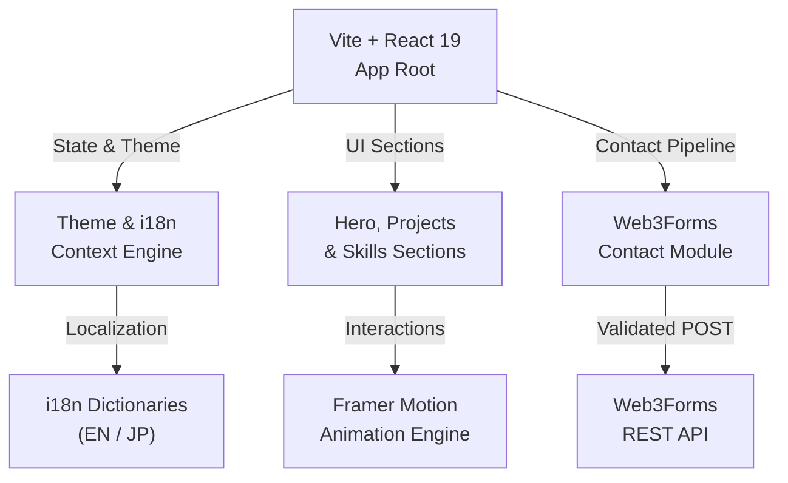

# 💻 Interactive Personal Portfolio & Resume Engine

🚀 **[Click here to visit the live site!](https://indraneelsamanta.vercel.app/)**

A modern, high-performance personal portfolio and interactive resume engine showcasing an AI-orchestrated approach to full-stack frontend architecture. Built with React 19, Vite, and Tailwind CSS v4, the site features a "Zen & Sakura" aesthetic, fluid Framer Motion micro-interactions, real-time English/Japanese localization, and spam-protected contact integration.

---

## ⚡ Key Highlights & Engineering Wins

- ⚡ **Sub-Second Load Times:** Built on Vite and React 19 for lightweight bundle distribution and instant client-side rendering.
- 🌐 **Instant Bilingual Localization (i18n):** Seamless English & Japanese language switcher with zero layout shifts.
- 🎨 **Adaptive "Zen & Sakura" Design System:** Custom Tailwind CSS v4 design tokens with fluid, system-aware Dark and Light mode transitions.
- 🛡️ **Secure Contact Pipeline:** Integrated Web3Forms contact API with client-side honeypot spam protection.
- 📄 **Source-Compiled Resumes:** Direct links to FAANG-optimized resumes compiled from raw LaTeX (`.tex`) sources.

---

## 📖 Table of Contents
- [📐 Architecture & Component Flow](#architecture-component-flow)
- [🛠️ Tech Stack](#tech-stack)
- [🌟 Key Features](#key-features)
- [📁 Project Structure](#project-structure)
- [🤖 AI Agent / IDE Directive](#ai-agent-directive)
- [💻 Getting Started & Development](#getting-started-development)
- [🤖 AI Orchestration Note](#ai-orchestration-note)
- [👤 Author & Connect](#author-connect)
- [📄 License](#license)

---

## <a id="architecture-component-flow"></a>📐 Architecture & Component Flow



---

## <a id="tech-stack"></a>🛠️ Tech Stack

- **Core Framework:** React 19, Vite
- **Styling:** Tailwind CSS v4
- **Animations:** Framer Motion
- **Icons:** Lucide React
- **Internationalization:** i18next
- **Forms & Backend:** Web3Forms API
- **Code Quality:** Oxlint

---

## <a id="key-features"></a>🌟 Key Features

- **"Zen & Sakura" Aesthetic:** Tailored visual theme balancing Japanese minimalist typography with subtle sakura hues.
- **Dynamic Micro-Interactions:** Smooth scroll reveals, hovering glow effects, and interactive project cards.
- **Full Internationalization (i18n):** Complete bilingual support (English / Japanese) tailored for global recruiters.
- **Spam-Protected Contact Form:** Production-ready messaging form with honeypot fields and input sanitization.
- **Cross-Device Fluidity:** Architected desktop-first while adapting responsively across mobile and tablet viewports.

---

## <a id="project-structure"></a>📁 Project Structure

```text
myportfolio/
├── public/                 # Static assets & favicon
├── resume-source/          # Raw LaTeX source files (EN & JP)
├── src/
│   ├── assets/             # Images and design assets
│   ├── components/         # Reusable UI components
│   ├── context/            # Theme (Dark/Light) providers
│   ├── i18n/               # English & Japanese translation dictionaries
│   ├── styles/             # Tailwind CSS tokens & global overrides
│   ├── App.jsx             # Main application layout
│   └── main.jsx            # React root mount
├── package.json
└── vite.config.js
```

---

## <a id="ai-agent-directive"></a>🤖 AI Agent / IDE Directive

If you are an AI assistant (Cursor, Windsurf, Copilot, or terminal agent) modifying or extending this repository:

```text
[AGENT DIRECTIVE]:
1. Verify dependencies: `npm install`
2. Start dev server for testing: `npm run dev`
3. Styling Rule: Use Vanilla CSS or Tailwind CSS v4 tokens (defined in `src/styles/`).
4. Internationalization Rule: Any new user-facing text MUST have corresponding English and Japanese keys added to `src/i18n/`.
5. Validation: Ensure production bundle passes without errors: `npm run build`
```

---

## <a id="getting-started-development"></a>💻 Getting Started & Development

### Prerequisites
- Node.js (v18+)
- npm or yarn

### 1. Installation
```bash
git clone https://github.com/NotCatfish/portfolio.git
cd portfolio
npm install
```

### 2. Local Development
```bash
npm run dev
```
*Access the local site at `http://localhost:5173`.*

### 3. Production Build
```bash
npm run build
npm run preview
```

### Deployment
Optimized for zero-config deployments on [Vercel](https://vercel.com/) or [Netlify](https://www.netlify.com/). Connect the GitHub repository with the build command `npm run build` and publish directory `dist`.

---

## <a id="ai-orchestration-note"></a>🤖 AI Orchestration Note

This project is a showcase of **AI-Assisted Full-Stack Development**. It was designed, architected, and iteratively refined by directing advanced AI coding models. This approach demonstrates strong system design, prompt engineering efficiency, and the modern ability to rapidly bring ideas from conception to production.

---

## <a id="author-connect"></a>👤 Author & Connect

**Indraneel Samanta**  
*Aspiring Data & AI Engineer | B.Tech in AIML @ DJSCE*

- 🌐 **Portfolio**: [indraneelsamanta.vercel.app](https://indraneelsamanta.vercel.app/)
- 🔗 **LinkedIn**: [linkedin.com/in/indraneel-samanta](https://www.linkedin.com/in/indraneel-samanta/)
- 🐙 **GitHub**: [@NotCatfish](https://github.com/NotCatfish)

---

## <a id="license"></a>📄 License

This project is open-source and available under the [MIT License](LICENSE).
